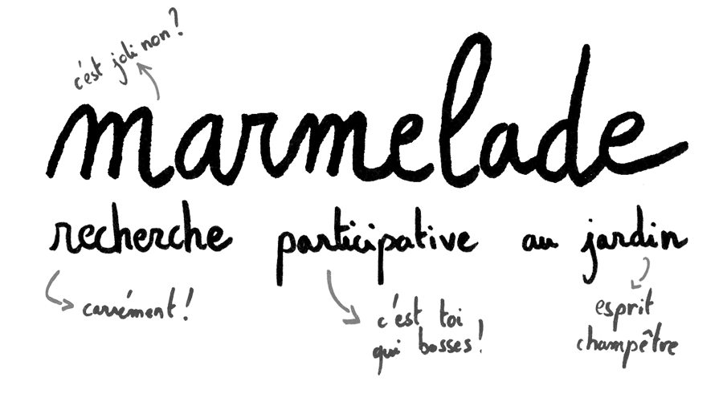
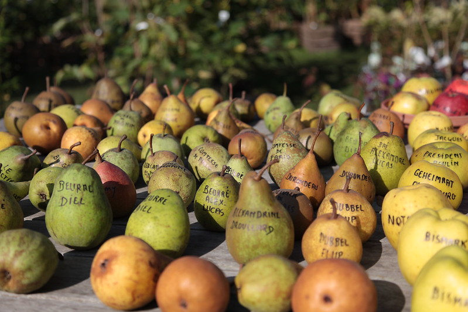
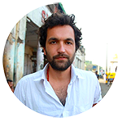

   

       
  

Photo d'<a href="https://www.flickr.com/photos/adulau/5075826879">Alexandre Dulaunoy (cc-by-sa)</a>

Même en photo, la diversité des formes saute aux yeux ! C'est l'idée de ce projet : quantifier la variabilité des organes (feuilles, fruits, etc.) des espèces fruitières, pour mieux les comprendre.

Ce projet est participatif car il compte sur **vous** pour collecter ses données brutes, des photos et des scans de fruits et de légumes.

Vous pouvez participer si :

 * vous avez des arbres fruitiers dont vous connaissez la variété ;
 * un scanner ;
 * 15 minutes devant vous.
 

## Protocole de prélèvement
 * [**Lien protocole**](protocole/feuilles.md)
 * [**Lien formulaire**](https://forms.gle/88nU4t7EueY1fg348)
 
## Qu'est-ce qu'on cherche ?

Ce projet est un ballon d'essai pour des recherches au long cours qui visent à :

 - quantifier la diversité de forme des feuilles, graines et fruits des espèces fruitières au sein des espèces, des variétés et des individus ;
 - explorer la structure de cette diversité morphologique... si elle est structurée ;
 - tester l'existence de liens entre la forme, le climat, les années, les pratiques, etc. et les creuser ;
 - aider à l'identification de variétés connues, nouvelles, oubliées, synonymes, etc. à partir de photographies.
 
## Qu'est-ce qu'on gagne ?
En sus de ma chaleureuse reconnaissance :

* Vos photos seront placées dans le [domaine public](https://creativecommons.org/publicdomain/zero/1.0/deed.fr) et seront donc librement disponibles, notamment pour la communauté scientifique ;
* Vous serez remercié.e dans les productions scientifiques ;
* J'en diffuserai les résultats sous forme conviviale.

## Mais quel est donc le contexte scientifique ?

Depuis la préhistoire, nous manipulons les plantes pour les plier à nos goûts et à nos climats. Mais les plantes ont aussi trouvé une main qui les chérit, les multiplie, les diversifie et qui explore, à tâtons, des potentialités développementales inconnues dans la "nature".

Du cerisier du grand-père à la Granny Smith, de l'unique au clone mondialisé, ce que nous consommons est le produit direct de l'histoire partagée des humains et des plantes. Cette biodiversité _cultivée_, ou agrobiodiversité, est unique en son genre. C'est un héritage commun et vivant, menacé de toutes parts par ce que l'on désigne en termes galants de "monde moderne".

Ici, le point d'entrée dans cette diversité est la forme des organes. Ce n'est pas moins sexy que l'ADN, c'est tout à fait autre chose : le résultat de l'ADN, plus tout le reste. Mesurer la forme c'est en outre rapide, simple, décentralisable, écologique, gratuit et autorisé pour les enfants.

En biologie des plantes, l'analyse des formes est surtout populaire sur des restes archéobotaniques. Le matériel retrouvé est souvent déformé, toujours rare mais livre (parfois) un éclairage unique sur la diversité cultivée passée.

Paradoxalement, les variétés actuelles ne sont que peu étudiées quantitativement avec ces approches alors que le matériel est frais, illimité et identifié. On peut donc raisonnablement espérer détecter des signaux encore plus subtils, et éclairer sur l'histoire des variétés et la biologie des espèces.

## Que deviennent mes photos ?

Dans un premier temps, nous allons tester l'intérêt de l'approche morphométrique sur ces espèces,  pratiquée en routine au labo. 

Les photos sont d'abord traitées par des machines et la forme du contour des feuilles est extraite sous forme de coordonées `(x; y)` de pixels.

Ces coordonées vont être homogénéisées, puis converties en variables quantitatives à l'aide de transformées elliptiques de Fourier. C'est un joli nom pour une transformation mathématique non moins élégante, que vous avez déjà pratiquée si vous avez joué avec un spirographe.

Vu que l'on a désormais des variables confortables, traduisant la forme de façon compacte et objective, on peut :

* chercher les principales composantes de la variation morphologique ;
* identifier des familles de formes et des regroupements ;
* identifier les espaces morphologiques sous- et sur-representés ;
* mesurer des distances entre formes ;
* reconstruire des trajectoires entre formes et des formes moyennes ;
* tester le lien avec d'autres variables "externes" ;
* simuler d'autres formes ;
* etc.

Les données que vous collectez serviront à entraîner les premiers modèles, et tester l'existence de patrons intéressants.

Je constituerai moi-même un autre jeu de données sur des collections existantes dans des conditions aussi standardisées que possible. Il est vraisemblable que je ménerai les premières analyses sur ce jeu de données.

"Vos" photos seront elles analysées en fonction des données disponibles, et j'espère vous livrer les premiers résultats début 2021.

## Qui porte ce projet rigolo ?

   | [www.vincentbonhomme.fr]()

Je suis un scientifique enthousiaste avec un doctorat en écologie évolutive.

Je m'intéresse à l'évolution des plantes domestiquées, et mes recherches visent à mieux comprendre où, quand, comment et pourquoi leurs formes évoluent.

En 2020, je suis en post-doctorat au CNRS ([équipe DBA, UMR ISEM](http://www.isem.univ-montp2.fr/fr/equipes/dynamique-de-la-biodiversite-anthropoecologie-index/), Montpellier). Je suis embauché sur le [projet ANR](https://anr.fr/Projet-ANR-16-CE27-0013)  "Viticulture: Vignes et vins en France du Néolithique au Moyen Âge. Approche intégrée en archéosciences" piloté par Laurent Bouby.

En pratique, j'essaie de faire parler ~50k pépins de raisin. J'arrive à la fin de la chaîne : pour moitié ces pépins ont été cueillis, amoureusement crachés puis photographiés par mes collègues ; les autres ont plusieurs siècles ou milliers d'années et ont été patiemment collectés lors de fouilles archéologiques.

Je développe par ailleurs [MomX](http://momx.github.io), un écosystème libre en R pour permettre, massifier et populariser l'analyse de la forme, en général.

En 2020, Marmelade est développé sur mon temps libre.

## Budget
Parce que je vous dois la transparence, ce projet est totalement autofinancé ; son budget total est de 3 €, pour l'achat du nom de domaine. 

En revanche, le temps que vous et moi y consacrez n'a pas de prix, et sera utile pour moi-même, et j'espère pour plein d'autres voire pour nous tou.te.s.

## Contacts

<projet.marmelade@gmail.com>  
+33.(0)6.95.90.55.79  

[Facebook](https://www.facebook.com/Marmelade-100577291640542)  

Vincent Bonhomme  
Lacamp  
30440 Roquedur  

## Merci
 * D'être arrivé.e jusqu'ici
 * Aux structures ci-dessous de bien avoir voulu diffuser ce programme :
 	* [Fruits Oubliés](http://fruitsoublies.org/) : réseau pour la diversité fruitière et alimentaire

