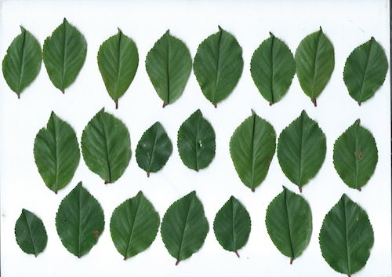

# Marmelade
recherche participative au verger
> Vous cherchez le [formulaire de dépôt]() ?

## En bref
Du cerisier en pot au verger de collection, la diversité des arbres fruitiers nous régale les papilles _et_ les yeux :

[photo]

Même en photo, la diversité des formes saute aux yeux ! C'est tout l'idée de ce projet : quantifier la variabilité des organes (feuilles, fruits, etc.) pour mieux comprendre la diversité des espèces fruitières.

Ce projet est participatif car il compte sur **vous** pour collecter ses données brutes, en commençant par des scans de feuilles.

## Comment participer ?
Vous pouvez participer si vous avez :

* un ou plusieurs arbres fruitiers sur lequels prélever 30 feuilles ou plus ;
* un scanner pour faire un tombinoscope de ces feuilles ;
* 10 minutes devant vous.

À ce stade, le projet se concentre sur les pommiers et les pruniers mais vous pouvez envoyer ce que vous avez sous la main.

Vous pouvez échantillonner plusieurs arbres de la même variété ou de variétés différentes. Ce seront autant de réplicats précieux lors des analyses.

Mais dans l'idée, si vous avez un seul arbre, acheté en grande surface sous la variété "Déstockage -50%", vous pouvez également participer.

## Protocole de collecte
Le protocole pour cet essai est simple et rapide (~10 min par arbre) :

1. Prélevez 30 feuilles ou plus sur un même arbre. Ne dénudez pas la même branche, au contraire, cherchez à échantilloner tout autour de l'arbre. Ne retenez que les feuilles "typiques" ni trop petites, ni trop grandes, sans traces d'herbivorie, de trous, etc.
2. Scannez ces feuilles (idéalement en `jpg`, 600 dpi max). Essayer de les poser bien à plat et sans recouvrement entre feuilles.
3. Téléversez l'image sur le formulaire de dépôt et renseignez les champs pour lesquels vous avez l'information.

Voilà le type de photo que vous devriez obtenir :

## En échange
En sus de ma chaleureuse reconnaissance :

* Vos photos seront placées dans le [domaine public](https://creativecommons.org/publicdomain/zero/1.0/deed.fr) et seront donc librement disponibles, notamment pour la communauté scientifique ;
* Vous serez remercié.e dans les productions scientifiques ;
* J'en diffuserai les résultats sous forme conviviale.

## Objectifs
Ce projet est un ballon d'essai pour des recherches au long cours qui visent à :

 - quantifier la diversité de forme des feuilles, graines et fruits des espèces fruitières au sein des espèces, des variétés et des individus ;
 - explorer la structure de cette diversité morphologique... si elle est structurée ;
 - tester l'existence de liens entre la forme, le climat, les années, les pratiques, etc. ;
 - aider à l'identification de variétés connues, nouvelles, oubliées, synonymes, etc. à partir de photographies.
 
## Contexte scientifique

**Les plantes domestiquées**  
Depuis la préhistoire, nous manipulons les plantes pour les plier à nos goûts ou à nos climats. Mais les plantes ne sont pas en reste : elles ont trouvé des jardiniers qui les chérissent, les multiplient, les diversifient. La main qui sélectionne explore, à tâtons, des terres inconnues des potentialités développementales inconnues dans la nature.

Du Pinot noir à la Picholine, du cerisier du grand-père à la Granny Smith, de l'unique au clone mondialisé, ce que nous consommons est le produit direct de l'histoire partagée des humains et des plantes. 

**Une biodiversité unique**  
Cette biodiversité _cultivée_, ou agrobiodiversité, est unique en son genre. La main qui sélectionne explore, à tâtons, des potentialités développementales inconnues dans la "nature" : des goûts, des couleurs, des formes, des aptitudes de culture.

C'est un patrimoine commun, vivant, précieux et menacé de toutes parts par ce que l'on désigne en termes galants de "monde moderne".

**Pourquoi la forme ?**  
Le point d'entrée dans cette diversité est la forme des organes, à commencer par les feuilles. Non, la forme ce n'est pas moins bien que l'ADN. C'est tout à fait autre chose : le résultat de l'ADN en interaction avec tout le reste. Et puis mesurer la forme, c'est rapide, simple, écologique, gratuit et autorisé pour les enfants.

Paradoxalement, les variétés actuelles pourtant à portée de main ne sont pas étudiées, alors que les restes archéologiques, souvent déformés, toujours rares, sont scrupuleusement analysés et parviennent à livrer des éclairages uniques [refs].

Qui peut le plus peut le moins ! Faisons un essai, ensemble, sur nos arbres, dont la quantité de données n'est limitée que par l'effort d'échantillonnage que l'on peut y consacrer. On peut donc raisonnablement espérer identifer des différences subtiles.

## Porteur
[Vincent Bonhomme](http://www.vincentbonhomme.fr)

J'ai un doctorat d'écologie évolutive mais je me définirais surtout comme un scientifique enthousiaste. 

Je m'intéresse à l'évolution des plantes domestiquées, et mes recherches actuelles visent à mieux comprendre comment et pourquoi évoluent les formes chez ces espèces, en particulier chez la vigne "archéologique".

Je développe par ailleurs [MomX](http://momx.github.io), un écosystème open-source pour permettre, massifier et populariser l'analyse de la forme, en général.

En 2020, je suis en post-doctorat au CNRS ([équipe DBA, UMR ISEM](http://www.isem.univ-montp2.fr/fr/equipes/dynamique-de-la-biodiversite-anthropoecologie-index/), Montpellier) sur le [projet ANR](https://anr.fr/Projet-ANR-16-CE27-0013)  "Viticulture: Vignes et vins en France du Néolithique au Moyen Âge. Approche intégrée en archéosciences" piloté par Laurent Bouby.

## Budget
Parce que je vous dois la transparence, ce projet est totalement autofinancé ; son budget total est de 3 €, pour l'achat du nom de domaine [marmelade.online](). 

Le temps que vous et moi y consacrez n'a lui pas de prix, et sera utile pour moi-même et j'espère pour plein d'autres.

## Partenaires
Les structures ci-dessous ont bien volontiers accepter de diffuser ce programme. Merci à elles !

* bla
* bla
* 
---
